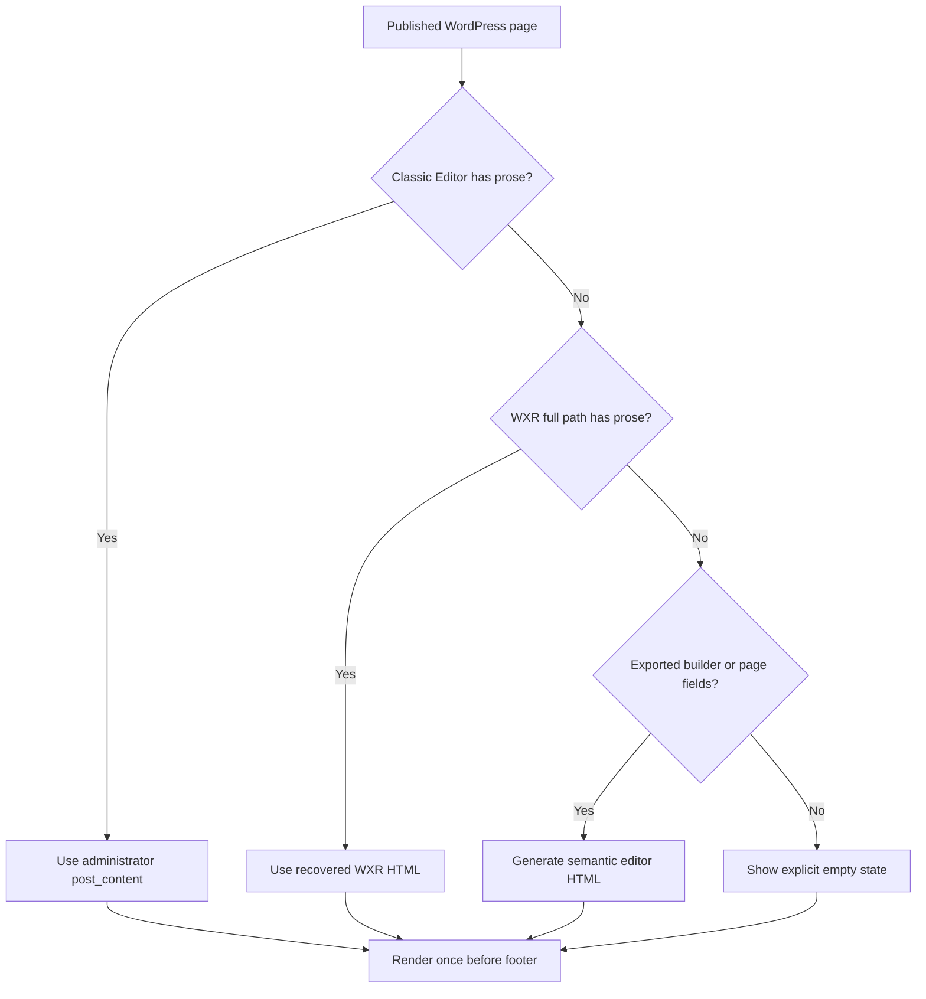

# Teznevise live WordPress audit and 1.9.6 remediation report

**Site:** https://teznevise.ir/  
**Audit date:** 2026-08-22 (Asia/Tehran)  
**Repository branch audited:** `main`  
**Repository baseline:** `8b89c2f4b308bc600df07414a49de309832853e8`  
**Implementation target:** WordPress/PHP theme only; `react-app/` was deliberately excluded  
**Prepared release:** `1.9.6`

## 1. Executive decision

The live WordPress site is operational, but it is not release-complete. The main defect is architectural: editorial `post_content`, functional shortcodes, builder sections, and the pre-footer «مشاهده بیشتر» component were coupled to the same helper. That caused the homepage to use a static special case, most pages to omit the component, classic-only pages to render content in the wrong location, and calculators to execute more than once.

The supplied 1.9.6 patch replaces that architecture. Every WordPress page receives one dynamic Classic Editor disclosure immediately before the footer. Calculators and forms remain in their normal body position, but they are stored separately from editorial content. The patch also addresses the shared mobile alignment shown in all twelve screenshots, the dead statistics route, REST user enumeration, lead-form abuse controls, and important AI endpoint defects.

**Deployment decision:** deploy only after a database/theme backup and a PHP syntax pass on the target PHP 8.3 runtime. The workspace did not contain a PHP CLI binary, so PHP execution is the one mandatory pre-deployment gate that could not be completed locally.

## 2. Evidence and scope

### 2.1 Live coverage

The live audit used the public WordPress site and its XML sitemap, not the React application.

| Evidence set | Coverage/result |
|---|---:|
| XML sitemap index | 6 child sitemaps: posts, pages, downloads, case studies, categories, download categories |
| Sitemap URLs opened and DOM-checked | 121/121 |
| Final HTTP result within sitemap | 121 returned a final 200 response |
| Published pages in latest WXR (`2026-08-21`) | 105 |
| WXR pages containing only a shortcode | 68 |
| WXR pages empty | 15 |
| WXR pages containing recoverable editorial copy | 22 |
| URLs without exactly one H1 | 44/121 |
| URLs containing duplicate DOM IDs | 20/121 |
| URLs with a «مشاهده بیشتر» toggle | 20/121 |
| URLs with the intended `.tz-classic-disclosure` | 19/121 |
| URLs with missing image alternative text | 2/121 |
| Mean observed HTML TTFB | 7.68 seconds |
| Worst observed HTML TTFB | 16.69 seconds (`/account/`) |

`/statistics/` is linked by the live theme but is not a valid sitemap page and returned a WordPress 404. `/service-statistics/` is the published statistics landing page and returned 200.

### 2.2 Page-family ledger

No sitemap page family was excluded. Shared fixes were chosen because they cover the complete catalogue, including pages not present in the screenshots.

| Family | Examples checked | Relevant shared contract |
|---|---|---|
| Homepage | `/` | dynamic footer disclosure; remove static block |
| Thesis hub and chapters | `/thesis/`, `/thesis/chapter-one/` … `/chapter-five/` | builder + classic source; centred mobile cards |
| Thesis disciplines | `/thesis/humanities/`, `/engineering/`, `/medical-sciences/`, `/international/` and descendants | shared service cards and disclosure |
| Proposal hub/levels | `/proposal/`, `/proposal/master/`, `/proposal/phd/` | shortcode migration and one-H1 contract |
| Statistics/service aliases | `/service-statistics/`, `/statistics/` | canonical internal URL and 301 alias |
| Calculator hub | `/online-calculation-tools/` | hub remains functional; dynamic footer copy |
| All calculator children | descriptive, ANOVA, t-test, correlations, reliability, non-parametric, regression, chi-square, ICC, power, sample-size | execute once; embedded H1→H2; no duplicate IDs |
| Project/service descendants | `/project/...`, `/article/...` | shared page renderer and card alignment |
| About/company | `/about-us/`, `/our-story/`, `/our-team/`, `/achievements/`, `/careers/`, `/join-us/`, `/testimonials/` | recovered WXR prose and mobile card/footer alignment |
| Contact/conversion | `/inquiry/`, `/contact-us/`, `/contact/` | functional form retained; rate limit and retention |
| Downloads/case studies | archives, items, categories | audited for status/headings/IDs; page disclosure applies to page post type only |
| Blog/posts/categories | posts and taxonomy URLs | audited for status/headings/alts; not forced into the page-only Classic Editor component |
| Legal/policy | privacy, terms, cookies, payment/refund/research rules | WXR prose preserved, sanitized, and moved to one pre-footer disclosure |
| Account/search/404 | `/account/`, public search, invalid `/statistics/` | performance/security/heading evidence; route fix for statistics |

### 2.3 Screenshot mapping

| Screenshots | Observed defect | Shared remediation |
|---|---|---|
| 1, 3, 4, 5, 7, 8, 10 | card icon/title/copy aligned to the RTL start instead of a common centre axis | mobile card selector contract at `≤768px` |
| 2 | off-canvas menu has an excessively tall internal scroller and competes with fixed UI | `100dvh`, contained scrolling, stable gutter, bottom safe-area padding |
| 6, 8, 9, 10 | chat control overlaps the last visible card/CTA | smaller FAB, 94px bottom clearance, document bottom reservation |
| 1–12 | fixed bottom navigation covers content at the end of scroll | body and scroll target safe-area padding |
| 11–12 | footer brand, columns, contact values, legal links, and badges do not share an axis | mobile footer centre alignment without changing long-form page copy |

## 3. Root cause: why «مشاهده بیشتر» was incomplete

### Before 1.9.6

1. `front-page.php` hard-coded an unrelated five-paragraph SEO guide.
2. `footer.php` called `teznevise_the_page_leftover_content()`, but the same helper was also called inside several page templates.
3. `inc/extracted-pages.php` explicitly returned classic-only content in its normal position and explicitly refused to add a footer disclosure.
4. Builder pages used the same helper to execute calculators/forms and to render classic prose, so execution order and duplicate prevention depended on which template called it first.
5. The one-time WXR importer was keyed by slug, handled only 22 pages, could not safely distinguish duplicate child slugs, and never reran after its old option was set.
6. Recovered WXR HTML could contain additional H1 elements and unscoped IDs.

### 1.9.6 content contract

Functional calculators/forms are extracted to private `_teznevise_functional_shortcodes` metadata during migration and stay in their normal page position. Editorial `post_content` therefore contains content, not layout shortcodes.

The final disclosure:

- is page-only (`is_page()`), not forced onto posts/download items;
- appears immediately before `</main>` and the site footer;
- renders once per post ID;
- runs normal `the_content` formatting in a recursion guard;
- strips all remaining shortcodes from editorial sources;
- sanitizes output with `wp_kses_post`;
- demotes embedded H1 elements to H2;
- namespaces editor IDs and updates internal references;
- uses an accessible button with `aria-controls` and `aria-expanded`.

## 4. Findings and disposition

### Severity definitions

| Priority | Definition |
|---|---|
| P0 | Broken core route/content/action or credible security/privacy exposure |
| P1 | Major cross-site UX, SEO, performance, conversion, or maintainability defect |
| P2 | Important accessibility, consistency, observability, or operational gap |
| P3 | Minor cleanup/documentation defect |

### Findings index

| ID | Priority | Finding | Disposition |
|---|---:|---|---|
| WP-001 | P0 | Homepage disclosure is static and most pages have none | Fixed in 1.9.6 |
| WP-002 | P0 | Functional shortcodes and editor prose share one renderer and may execute twice | Fixed in 1.9.6 |
| WP-003 | P0 | `/statistics/` is a live 404 reached from the theme | Fixed: link update + 301 |
| WP-004 | P0 | Public REST `/wp/v2/users` enumerates two accounts | Fixed in 1.9.6 |
| WP-005 | P0 | AI chat exposed/stored answer text as `thinking_process`, accepted provider/model amplification, and shared guest quota | Fixed in 1.9.6 |
| WP-006 | P1 | 44 sitemap URLs do not have exactly one H1 | Partly fixed; post-deploy crawl required |
| WP-007 | P1 | 20 URLs contain duplicate IDs, concentrated in calculators | Root cause fixed; post-deploy crawl required |
| WP-008 | P1 | Mean TTFB 7.68s; max 16.69s | Open: hosting/cache/database work |
| WP-009 | P1 | Mobile repeated cards are not centred | Fixed in shared CSS |
| WP-010 | P1 | FAB and bottom nav obscure content | Fixed in shared CSS; device QA required |
| WP-011 | P1 | Mobile drawer scrolling/height competes with fixed controls | Fixed in shared CSS |
| WP-012 | P1 | Mobile footer columns and brand are inconsistently aligned | Fixed in shared CSS |
| WP-013 | P1 | 68/105 exported pages are shortcode-only and 15/105 are empty | Non-destructive migration added |
| WP-014 | P1 | Old importer is one-shot, slug-only, and not observable | Versioned batched importer + report + CLI added |
| WP-015 | P1 | Lead endpoint has no abuse limit, stores raw IP, and ignores delivery status | Fixed in 1.9.6 |
| WP-016 | P1 | AI provider URL can become an SSRF/cost-amplification path if database agent settings are compromised | Provider host/model allow-lists added |
| WP-017 | P1 | AI API keys may still exist in plaintext database fields/options | Open: migrate to environment constant and erase DB copies |
| WP-018 | P1 | Missing HSTS/CSP; weak/duplicate legacy response headers observed | Partly fixed; nginx/CDN work required |
| WP-019 | P1 | Public HTML/API responses are unusually large; `wp-json/` was about 621KB | Open: route/cache/payload profiling |
| WP-020 | P1 | Multiple intent aliases and legacy content variants remain in the catalogue | Partly fixed; canonical inventory required |
| WP-021 | P2 | Two sitemap pages contain images without alt text | Open: repair Media Library/page content |
| WP-022 | P2 | Lead storage is an autoloaded option and not a scalable CRM table | Retention improved; data-model migration open |
| WP-023 | P2 | Existing historical lead/AI rows may retain raw IP/thinking values | Open: one-time privacy cleanup |
| WP-024 | P2 | Mail failure is not surfaced to the visitor/admin dashboard | Delivery result stored; alerting open |
| WP-025 | P2 | XML-RPC behavior depends partly on server/plugin routing | Theme disables it; confirm at edge |
| WP-026 | P2 | 404 response is a full heavy branded page, increasing error cost | Open: cache and reduce 404 payload |
| WP-027 | P2 | Release script cannot complete PHP lint when PHP CLI is absent | Target/CI gate required |
| WP-028 | P2 | CSS/JS bundles had manually appended behavior not represented in source | Fixed: source/build script made authoritative |
| WP-029 | P3 | `x-server-powered-by: Engintron` exposes infrastructure detail | Open: remove at nginx/Engintron |
| WP-030 | P3 | Obsolete `X-XSS-Protection` header is still emitted | Open: remove at server/plugin source |

## 5. Implemented file changes

### Dynamic editorial content

| File | Change |
|---|---|
| `front-page.php` | removed homepage-only static disclosure |
| `footer.php` | page-only, one pre-footer editorial disclosure; fixed statistics URL |
| `inc/extracted-pages.php` | separated interactive/editorial renderers, fallback sources, H1/ID sanitation, per-page once guard |
| `inc/wxr-classic-content.php` | full-path-aware, non-destructive, versioned ten-page batches; import report and WP-CLI command |
| `page.php`, `page-service.php`, `page-about.php`, `page-team.php`, `page-tools.php`, `page-downloads.php`, `page-contact.php` | functional widgets only at the body location |

### UI system

| File | Change |
|---|---|
| `assets/css/react-loader.css` | mobile card/footer centring, disclosure spacing, drawer containment, bottom-nav/FAB clearance, preserved RTL mega-menu |
| `assets/css/mobile-fixes.css` | external floating contact clearance |
| `assets/css/page-extras.css` | inaccessible honeypot moved off-canvas |
| `assets/js/react-loader.js` | retained calculator table captions/live-region enhancement in source |
| `scripts/build-frontend-bundles.py` | generated JS retains its accessibility block |
| generated `assets/css/chrome.css`, `assets/css/pages.css`, `assets/js/chrome.js` | rebuilt from maintained sources |

### Backend/security

| File | Change |
|---|---|
| `inc/security.php` | REST user route restriction, XML-RPC disable, generic login errors, safe theme-level headers |
| `inc/frontend-compat.php` | honeypot, same-origin redirect, 3/min rate limit, 90-day retention, no raw IP, stored mail result |
| `inc/ai/class-ai-api.php` | input limits, per-guest HMAC quota, 5/min burst cap, no raw IP, no chain-of-thought, host/model allow-list, upstream status checks |
| `inc/seo.php` | `/statistics/` → `/service-statistics/` 301 |
| `inc/defaults.php`, `inc/builder-defaults.json` | valid statistics landing URL |
| `functions.php` | load security module; version 1.9.6 |

## 6. Verification completed

| Check | Result |
|---|---|
| Live sitemap/DOM crawl | 121 URLs checked |
| Live manual page families | homepage, thesis, chapter, calculator, testimonials, footer, navigation |
| Latest WXR parsing | 105 published pages; 68 shortcode-only; 15 empty; 22 real-copy |
| JSON parse | PASS for builder, extracted-page, and WXR seed JSON |
| CSS/JS bundle rebuild | PASS |
| Node syntax (`chrome.js`, calculators, all repository JS) | PASS |
| Version consistency (`functions.php`, `style.css`, `readme.txt`, `README.md`) | PASS |
| Required files/assets/integrity checks | PASS |
| `git diff --check` | PASS |
| PHP syntax | **PENDING — PHP executable unavailable in workspace** |
| Authenticated wp-admin import | PENDING — no production credentials/database supplied |
| Post-deployment sitemap regression crawl | PENDING |

## 7. Required deployment sequence

1. Back up the production database and the active theme directory.
2. Run PHP syntax lint on every changed PHP file with the production PHP 8.3 binary.
3. Deploy the entire path-preserving 1.9.6 patch; do not upload only generated CSS.
4. Prefer `wp teznevise classic-content import`. Without WP-CLI, browse authenticated wp-admin until `teznevise_classic_import_version` equals `1.9.6` (the importer processes ten pages per request).
5. Inspect option `teznevise_classic_import_report`; resolve every page ID in `errors`.
6. Purge WordPress page/object cache, nginx/Engintron cache, and CDN cache.
7. Verify `/statistics/` produces one 301 hop to `/service-statistics/`.
8. Verify one page from every family in §2.2 at 360, 390, 768, 1024, and 1440 CSS pixels.
9. Re-crawl all six sitemaps. Acceptance: each WordPress page has one disclosure, one H1, no duplicate IDs, no raw shortcode text, no horizontal overflow, and no obscured final focus target.
10. Submit corrected sitemap/canonical pages for search reprocessing.

### Rollback

- Restore the backed-up theme directory.
- Restore the database only if the Classic Editor import must be undone; the importer intentionally changes `post_content` on empty/shortcode-only pages.
- The importer preserves functional shortcode text in `_teznevise_functional_shortcodes`, but rollback should still use the database backup rather than attempting a reverse transformation.

## 8. Server and database work not safe to guess in a theme

These items require hosting/admin authority and are intentionally not fabricated in PHP:

1. **Performance:** enable full-page cache for anonymous HTML, persistent object cache, PHP OPcache, Brotli/gzip, and profile slow database queries/plugins. Target cached TTFB ≤800ms and uncached ≤2s.
2. **HSTS:** add only after confirming every relevant subdomain is permanently HTTPS. Recommended starting point: `max-age=15552000`; add `includeSubDomains` only after validation.
3. **CSP:** capture actual script/style/image/connect origins, deploy report-only, fix violations, then enforce. Do not paste a guessed CSP that breaks calculators or chat.
4. **Headers:** remove duplicate `X-Content-Type-Options`, obsolete `X-XSS-Protection`, and `X-Server-Powered-By` at the emitting layer.
5. **AI secrets:** define `TEZNEVISE_AI_OPENAI_KEY` outside the database, rotate the current key, then delete plaintext agent/option values. Add extra provider hosts only through `teznevise_ai_allowed_api_hosts`.
6. **Privacy cleanup:** delete/harden historical `ip_address` and `thinking_process` values according to the retention policy; the patch prevents new raw values but does not silently destroy old records.
7. **Lead storage:** migrate `teznevise_leads` from a generic option to a non-autoloaded table/CPT with capabilities, audit log, export/deletion workflow, and scheduled retention.
8. **Observability:** alert on `wp_mail` failure, AI upstream 4xx/5xx, import errors, PHP fatals, cache bypass rate, and p95 TTFB.

## 9. Acceptance checklist for the fixing agent

- [ ] `php -l` passes for every PHP file.
- [ ] Theme reports version 1.9.6 everywhere.
- [ ] All 105 published WordPress pages have exactly one `.tz-classic-disclosure` immediately before the footer.
- [ ] Homepage no longer contains `#seoGuide` or the old static guide.
- [ ] Editing a page in Classic Editor changes that page’s disclosure without code changes.
- [ ] Classic Editor content has no `[tz_*]` or `[gravityform]` layout dependency after import.
- [ ] All 18 calculator widgets execute once, keep their JS IDs, and expose no H1 inside the widget.
- [ ] Every public page has exactly one H1 and no duplicate DOM IDs.
- [ ] Mobile card content is centred on every service/chapter/about/testimonial/stat family.
- [ ] FAQ answers, article copy, forms, and tables remain RTL start-aligned for readability.
- [ ] Drawer scrolls independently, closes via button/backdrop/Escape/link, and leaves no body scroll lock behind.
- [ ] Bottom nav and both contact controls do not cover the final card, CTA, footer link, or focus target.
- [ ] `/statistics/` returns 301 to `/service-statistics/`; sitemap/canonical/internal links agree.
- [ ] Anonymous `/wp-json/wp/v2/users` is unavailable; authorized admins retain access.
- [ ] Lead endpoint throttles, stores no raw IP, and expires records after 90 days.
- [ ] AI guest quotas are isolated, burst-limited, provider/model constrained, and store no new raw IP/thinking text.
- [ ] Cached p95 TTFB meets the agreed target.

## 10. Final status

The requested WordPress code remediation is implemented and packaged. It is not yet proof of production completion because the production database import, PHP runtime lint, cache purge, server headers, and post-deployment 121-URL regression crawl require deployment access. Those remaining actions are explicit above so an AI agent or engineer can execute them one by one without inferring scope.

